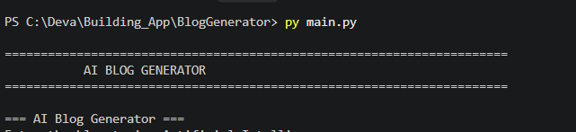
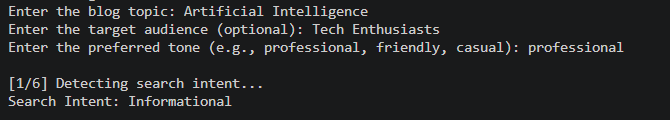
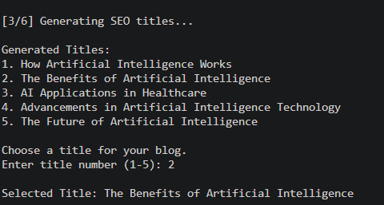
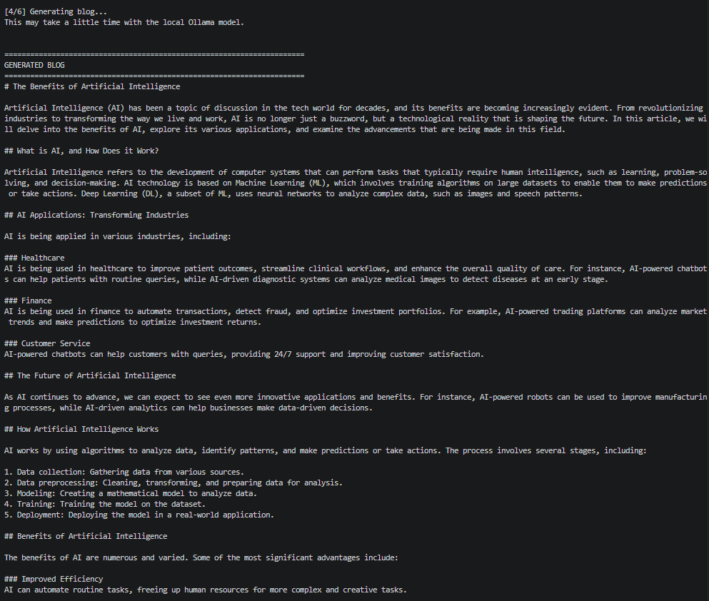
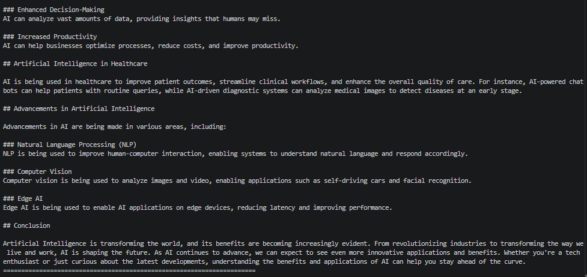
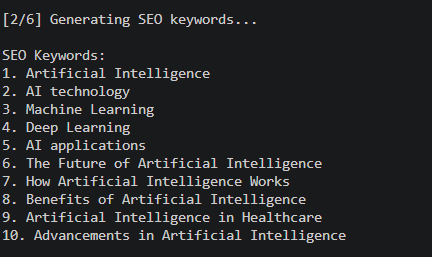

# AI Blog Content Generator

An AI-powered modular Python application that generates complete blog content based on a user-provided topic.

The application processes the user's topic and generates a blog title, blog content, summary, SEO keywords, and meta description using separate Python modules.

## Features

* User-friendly topic input
* Intent detection
* AI-generated blog title
* AI-generated blog content
* Automatic summary generation
* SEO keyword generation
* Meta description generation
* Saves generated blog content
* Modular Python architecture
* Demo execution support
* Screenshot-based demonstration

## Technologies Used

* Python
* Natural Language Processing (NLP)
* Artificial Intelligence
* Generative AI
* Modular Python Programming

## Project Structure

```text
Blog-Content-Generator/
|
+-- screenshots/
|   +-- HomeScreen.png
|   +-- Userinput_Intent_Detection.png
|   +-- blog_title.png
|   +-- BlogGeneration.png
|   +-- BlogGenerationpartII.png
|   +-- Summary_Generation .png
|   +-- SEO_Keywords.png
|   +-- Meta_Description .png
|   +-- Blog Saved_Successfully.png
|
+-- blog_module.py
+-- demo_run.py
+-- input_module.py
+-- intent_module.py
+-- keyword_module.py
+-- main.py
+-- meta_module.py
+-- summary_module.py
+-- title_module.py
+-- requirements.txt
+-- .gitignore
+-- README.md
```

## Installation

### 1. Clone the repository

```bash
git clone https://github.com/Devanandasunil/Blog-Content-Generator.git
```

### 2. Navigate to the project folder

```bash
cd Blog-Content-Generator
```

### 3. Create a virtual environment

```bash
python -m venv venv
```

### 4. Activate the virtual environment

For Windows:

```bash
venv\Scripts\activate
```

### 5. Install dependencies

```bash
pip install -r requirements.txt
```

## Running the Application

Run the main application:

```bash
python main.py
```

The application will prompt:

```text
=== AI Blog Generator ===
Enter the blog topic:
```

For example:

```text
The Future of Artificial Intelligence in Education
```

The application then processes the topic and generates the required blog content.

## Modules

| Module              | Purpose                          |
| ------------------- | -------------------------------- |
| `main.py`           | Main application workflow        |
| `input_module.py`   | Handles user input               |
| `intent_module.py`  | Detects the user's intent        |
| `title_module.py`   | Generates the blog title         |
| `blog_module.py`    | Generates blog content           |
| `summary_module.py` | Generates the blog summary       |
| `keyword_module.py` | Generates SEO keywords           |
| `meta_module.py`    | Generates the meta description   |
| `demo_run.py`       | Demonstration and testing script |

## Workflow

```text
User Topic
    |
    v
Input Processing
    |
    v
Intent Detection
    |
    v
Title Generation
    |
    v
Blog Content Generation
    |
    v
Summary Generation
    |
    v
SEO Keyword Generation
    |
    v
Meta Description Generation
    |
    v
Blog Output
```

## Screenshots

### Home Screen



### User Input and Intent Detection



### Blog Title Generation



### Blog Generation



### Blog Generation - Part II



### Summary Generation


### SEO Keywords



### Meta Description


### Blog Saved Successfully


## Purpose

This project demonstrates how AI and NLP techniques can be combined with a modular Python architecture to automate the process of creating structured and SEO-friendly blog content.

## Future Enhancements

* Web-based user interface
* Multiple language support
* Advanced SEO optimization
* Blog tone and style selection
* Word-count customization
* Cloud deployment
* Database integration
* Automated publishing to blogging platforms

## Author

**Devananda Sunil**

